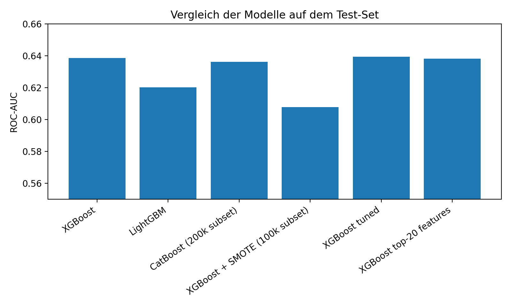
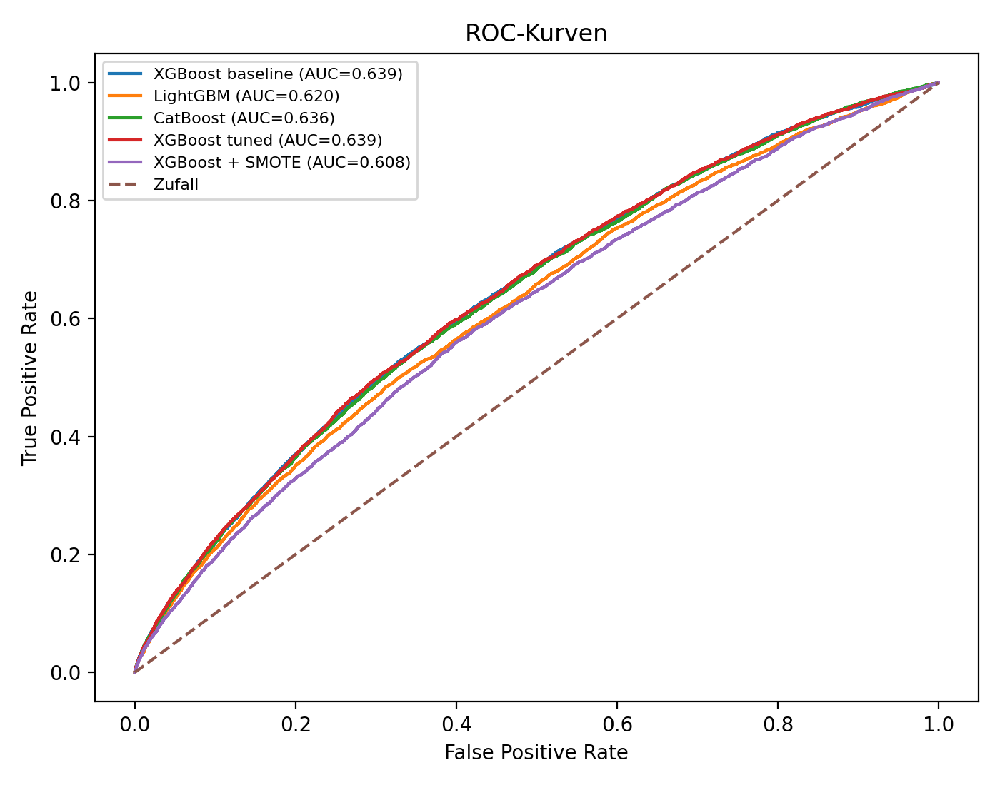

# Porto Seguro Safe Driver Prediction

Projet individuel réalisé dans le cadre du master **Data Analytics** à l'Université Justus-Liebig de Gießen en 2026.

L'objectif est de prédire la probabilité qu'un assuré déclare un sinistre à partir d'un jeu de données fortement déséquilibré. Le projet couvre toute la chaîne analytique : contrôle des données, analyse exploratoire, modélisation, comparaison des performances et interprétation des résultats.

## Compétences démontrées

- préparation et exploration de données avec Python et pandas ;
- gestion des valeurs manquantes et d'une cible très déséquilibrée ;
- modèles XGBoost, LightGBM et CatBoost ;
- comparaison de la pondération des classes et de SMOTE ;
- sélection de variables et analyse de leur importance ;
- évaluation avec ROC-AUC, PR-AUC, F1, rappel et précision ;
- restitution reproductible avec notebooks, scripts, tableaux et visualisations.

## Résultats principaux

| Modèle | ROC-AUC | PR-AUC | F1 | Rappel | Précision |
|---|---:|---:|---:|---:|---:|
| XGBoost baseline | 0,6385 | 0,0667 | 0,1145 | 0,2468 | 0,0746 |
| LightGBM | 0,6202 | 0,0624 | 0,1087 | 0,2106 | 0,0732 |
| CatBoost | 0,6361 | 0,0660 | 0,1124 | 0,1823 | 0,0813 |
| XGBoost avec SMOTE | 0,6078 | 0,0576 | 0,0999 | **0,3236** | 0,0591 |
| XGBoost optimisé | **0,6394** | 0,0665 | 0,1134 | 0,2796 | 0,0711 |
| XGBoost Top 20 | 0,6383 | 0,0667 | **0,1162** | 0,2275 | 0,0780 |

Le modèle XGBoost optimisé obtient la meilleure ROC-AUC. La variante limitée aux 20 variables les plus importantes conserve une performance proche tout en obtenant le meilleur score F1. SMOTE améliore le rappel, mais réduit les performances globales : le choix dépend donc du coût métier associé aux faux négatifs.





## Structure du dépôt

```text
├── notebooks/
│   ├── 01_eda.ipynb
│   └── 02_modeling.ipynb
├── src/
│   ├── data_utils.py
│   ├── eda.py
│   ├── baseline_model.py
│   ├── final_model.py
│   └── evaluation.py
├── figures/
├── results/
├── requirements.txt
└── README.md
```

## Reproduire l'analyse

```bash
python -m venv .venv
source .venv/bin/activate
pip install -r requirements.txt
```

Télécharger ensuite les données du concours **Porto Seguro's Safe Driver Prediction** depuis Kaggle et placer le fichier converti sous `data/dataset.arff`.

```bash
python src/eda.py
python src/baseline_model.py
python src/final_model.py --data data/dataset.arff --out results
```

Le jeu de données n'est pas inclus dans ce dépôt en raison de sa taille et des conditions de redistribution. Toutes les opérations aléatoires utilisent `random_state=42`.

## Limites

CatBoost et SMOTE ont été entraînés sur des sous-échantillons stratifiés pour limiter le temps de calcul. Leurs résultats ne sont donc pas strictement comparables aux modèles XGBoost entraînés sur l'ensemble d'apprentissage. Les faibles scores F1 illustrent aussi la difficulté de prédire la classe minoritaire.

## Auteure

**Aicha Agrien**  
Master Data Analytics · Université Justus-Liebig de Gießen

